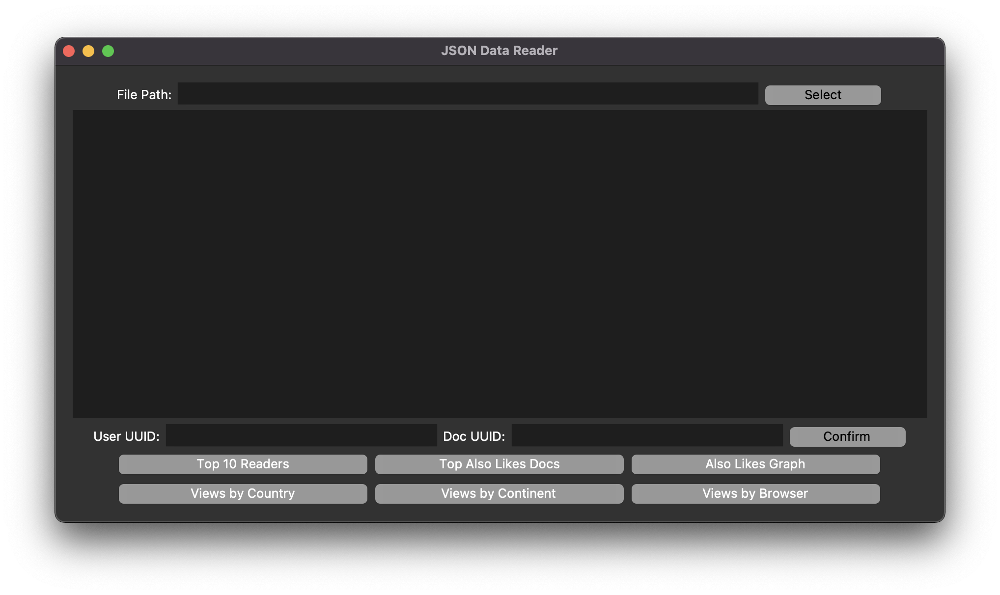
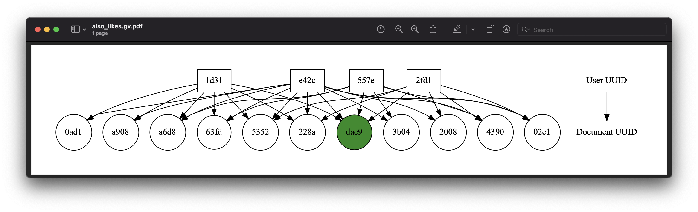

# Industrial Programming (F21SC) 

This repository contains a Python-based application for analyzing and displaying document tracking data from [issuu.com](https://issuu.com) website developed for Industrial Programming (F21SC) course.  
 
Developed by:
- Lina Rietuma (@linarietuma)
- Ryan Farish (@Officer-Friendly)

## Application 

The application analyses document usage data on [issuu.com](https://issuu.com) website. For a given document, a user can determine from which countries, continents and using what agent the document has been viewed. In addition, the app offers information on reader profiles and information about related documents based on document tracking information ('Also Likes' graph). 

## Usage 
The application offers a simple GUI but can also be used from a command line interface. For a detailed guide on application usage see [here](./user_guide.md)

## Built With 
The application is built in Python (3.8.12) and utilizes the following libraries:
- `argparse` (1.1) for command line interface tools 
- `unittest` for unit testing some of the JSON functions
- `re` (2.2.1) for use fo regex expressions
- `numpy` (1.21.4) for effective data manipulations
- `pandas` (1.3.4) for effective data manipulations
- `matplotlib` (3.4.2) for data visualization
- `pycountry_converter` for finding a country's respective continent based on ISO3166 codes
- `tkinter` for GUI development
- `graphviz` for 'Also Likes' graph visualization 

